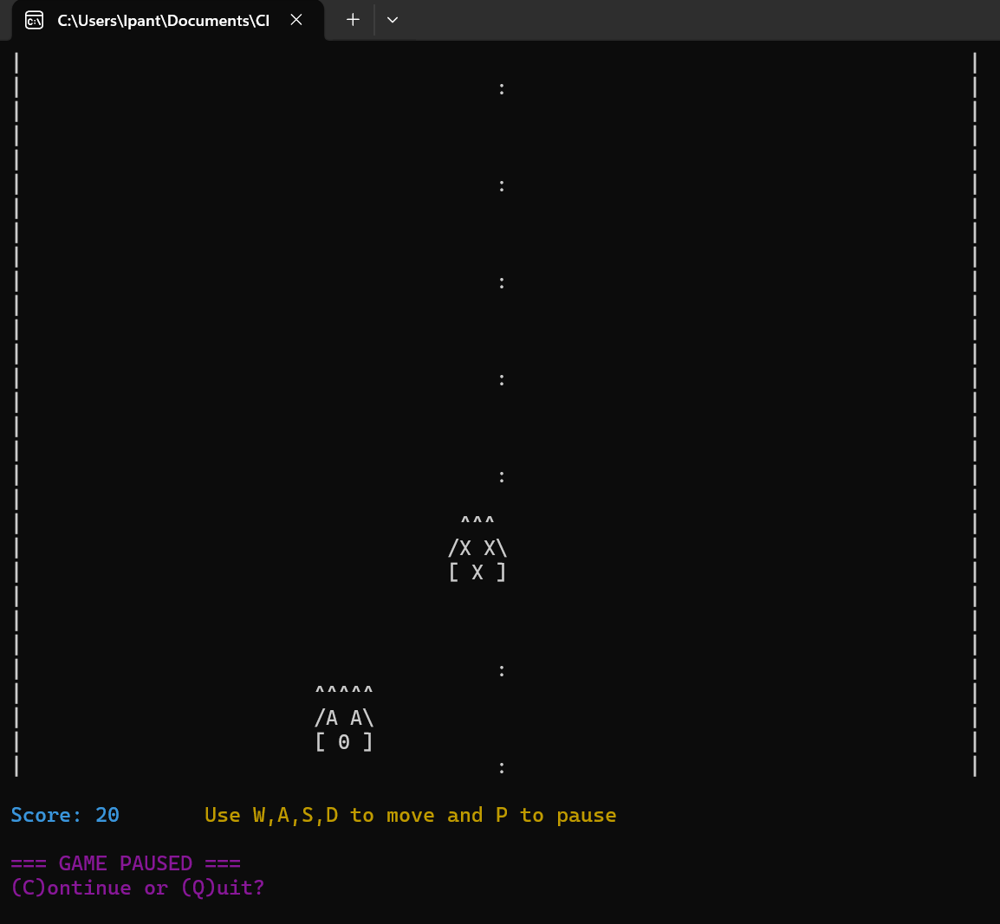
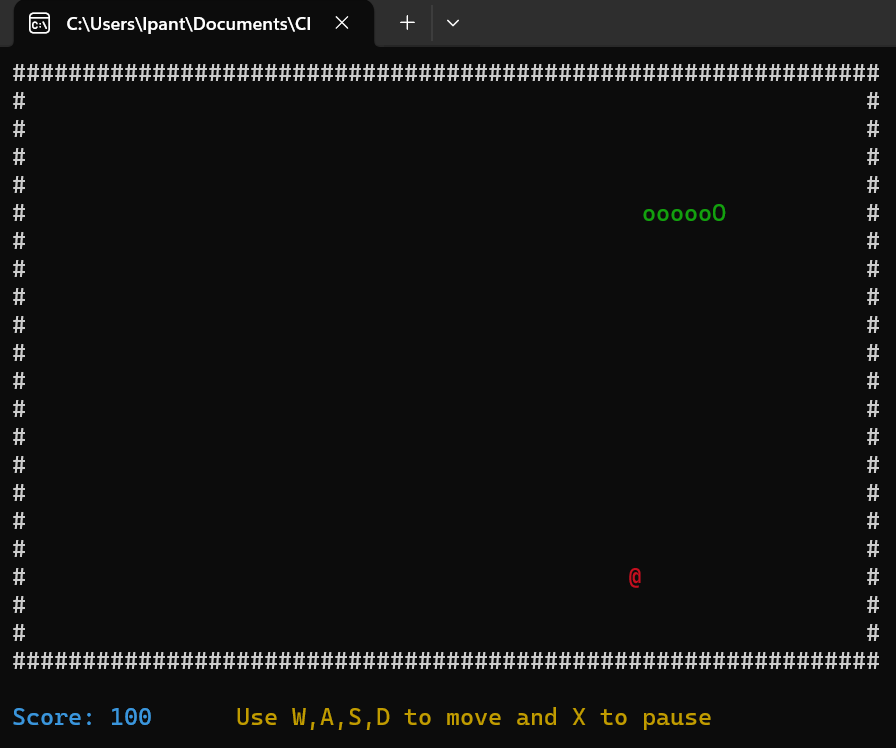
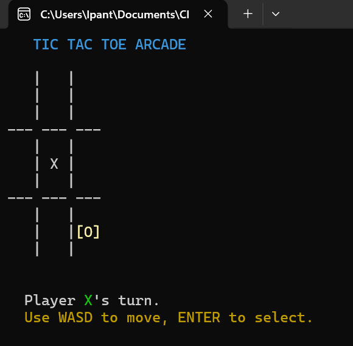

# 🕹️ Arcade Multi-Game Suite
**Developed by Liliana Pantoja | CIS-121 Final Project**

A high-performance C++ console application featuring three classic arcade games. This project showcases Object-Oriented Programming (OOP), real-time rendering techniques, and efficient memory management using the C++ Standard Template Library.

---

## 🚀 Features
* **Three-in-One Hub:** Seamlessly switch between Car Racing, Snake, and Tic Tac Toe.
* **Optimized Rendering:** Uses string-buffer techniques to eliminate terminal flickering during high-speed gameplay.
* **Dynamic Difficulty:** Obstacle speed and spawn rates scale based on your live score.
* **Professional Documentation:** Includes full technical analysis and program development lifecycle.

---

## 📸 Gameplay Manual

### 1. Car Racing Arcade

* **Objective:** Survive as long as possible by avoiding the 'X' obstacles.
* **Controls:** `A` to move Left, `D` to move Right.
* **Mechanic:** The game speed increases every 200 points.

### 2. Snake Arcade

* **Objective:** Eat the fruit to grow your tail without hitting the walls or yourself.
* **Controls:** `W`, `A`, `S`, `D` for directional movement.
* **Mechanic:** Uses `std::vector` to track tail coordinates dynamically.

### 3. Tic Tac Toe

* **Objective:** Get three in a row against a friend or the system.
* **Controls:** Numeric keypad (1-9) to select your square.

---

## 🛠️ Technical Implementation
This suite was built with a focus on clean code and modularity:
* **Classes & Objects:** Each game is encapsulated in its own class, allowing for independent logic and shared utility functions.
* **Windows API:** Utilized `GetAsyncKeyState` for non-blocking input, ensuring the games feel responsive even at high speeds.
* **Memory Management:** Implemented vectors for obstacle tracking to ensure no memory leaks during long play sessions.

---

## 📂 Project Structure
* `/assets` - Contains gameplay screenshots for documentation.
* `Main.cpp` - The entry point and main menu logic.
* `Arcade_Program_Development_Process.pdf` - Full technical design document.
* `.gitignore` - Configured to keep the repository clean of build artifacts.

---

## 🏁 Getting Started
1. Clone the repository:
   ```bash
   git clone [https://github.com/LilianaPT/Arcade-MultiGame-Suite.git](https://github.com/LilianaPT/Arcade-MultiGame-Suite.git)
